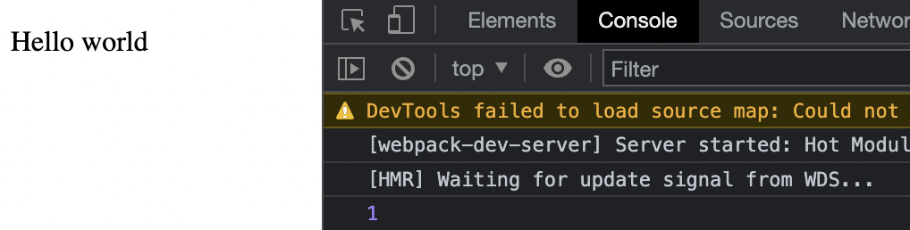
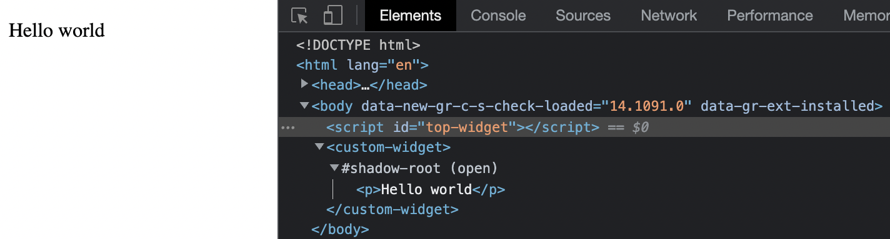

Sometimes, along with the main product, there is the need to create embeddable lightweight widgets, that your b2b customers can add to their website to show notifications, ads, quick chat functionality, etc.

In this blog post, I will show how I implemented it for our product. You will have a ready-to-insert script that will download and run the bundle file. The main requirement for our widget is the minimum number of technologies to use. I chose web components and a Shadow DOM for this project.

## What is Shadow DOM?

To cut a long story short, I would say that the Shadow DOM is a DOM with elements and styles that have their own scope. It is not affected by the main CSS of the website because it’s encapsulated. You can’t access the Shadow DOM elements with querySelector or other APIs and you don’t need to think about CSS collisions. Fantastic no?

You might think iframes are the most popular form of scoped DOMs and it’s better to use them, but iframes have their own disadvantages, such as cors, and responsiveness.

| Shadow DOM pros | Shadow DOM cons                                                      |
| --------------- | -------------------------------------------------------------------- |
| Scoped DOM      | Compatibility                                                        |
| Scoped CSS      | Using multiple Shadow DOM projectscan cause conflict with each other |
| Composition     | Accessibility                                                        |
| Performance     | Custom fonts                                                         |

> Just FYI, I’m going to include code snippets with explanations for each step, so that we can “code along” and figure it out bit by bit.

Also at the top of each snippet, you will find the name of the file, so you’re not confused about where to put it. But be careful not to copy it with the code, as it will cause an error for some extensions.

## Setting up our project

Let’s start building our project by creating a folder called ”whatever name you like”. Please open a shell and execute

```shell
npm init
```

Then install our first dependencies. I hope you are already familiar with `webpack` and know its purpose. Along with it, we're going to install Typescript for type checking and reducing the number of errors.

```shell
npm install --save-dev webpack webpack-cli webpack-dev-server typescript ts-loader html-webpack-plugin cross-env
```

If everything is fine, let’s create a file in the root of our directory with the name tsconfig.json and the next config inside. It's just simple instruction, which explains to Typescript how to read our code. Nothing advanced. You can read about each line [here](https://basarat.gitbook.io/typescript/project/compilation-context/tsconfig).

```json title="tsconfig.json"
{
  "compilerOptions": {
    "baseUrl": "src",
    "rootDir": ".",
    "moduleResolution": "node",
    "target": "es2015",
    "module": "esnext",
    "lib": ["esnext", "es2017", "ES2015", "dom"],
    "sourceMap": true,
    "declaration": false,
    "declarationMap": false,
    "noImplicitAny": true,
    "strict": true,
    "strictNullChecks": true,
    "strictBindCallApply": true,
    "strictFunctionTypes": true,
    "typeRoots": ["node_modules/@types"],
    "esModuleInterop": true,
    "allowSyntheticDefaultImports": true
  },
  "include": ["src/**/*"]
}
```

The next important part of our setup is configuring `webpack` to compile all our stuff. Please create the file called `webpack.config.js` in the root of the project directory. It comes with simple instructions for bundlers to transform our code into plain JS, CSS, etc.

```js title="webpack.config.js"
const path = require('path');
const webpack = require('webpack');
const HTMLWebpackPlugin = require('html-webpack-plugin');

module.exports = {
  entry: {
    Widget: './src/index.ts',
  },
  mode: 'development',
  output: {
    library: 'Widget',
    libraryTarget: 'umd',
    libraryExport: 'default',
    path: path.resolve(__dirname, 'dist'),
    filename: `widget.js`,
  },
  resolve: {
    extensions: ['.ts', '.js', '.scss'],
  },
  module: {
    rules: [
      {
        test: /\.ts$/,
        use: [{ loader: 'ts-loader' }],
      },
    ],
  },
  plugins: [
    new HTMLWebpackPlugin({ template: path.resolve(__dirname, 'index.html') }),
    new webpack.HotModuleReplacementPlugin(),
  ],
};
```

To end up our setup - create basic `index.html` and `index.ts` files in the root as previous files and put the next code inside to check if everything works properly.

```typescript title="index.ts"
console.log(1);
```

```html title="index.html"
<!DOCTYPE html>
<html lang="en">
  <head>
    <meta charset="UTF-8" />
    <title>Widget</title>
    <meta
      name="viewport"
      content="width=device-width, initial-scale=1, maximum-scale=1, user-scalable=0"
    />
  </head>
  <body>
    <p>Hello world</p>
  </body>
</html>
```

If you see the result of `console.log` in the browser, it appears that everything is functioning properly.



The setup is finished. Congrats, finally we can start our development.

## Development step

We can create custom HTML elements, described by our class, with their own methods and properties, events, and so on. There are two kinds of custom elements:

1. **Autonomous custom elements** – “all-new” elements, extending the abstract `HTMLElement` class.

2. **Customized built-in elements** – extending built-in elements, like a customized button, based on `HTMLButtonElement` etc.

In this tutorial, we need autonomous elements. To create a custom element, we need to tell the browser several details about it: how to show it, what to do when the element is added or removed from the page, etc. This is done by creating a class with special methods, which is easy to do, as there are only a few methods, and all of them are optional.

A browser calls the method `connectedCallback` when the element is added to the document. At that moment we create the `template` element and put our markup inside with `innerHTML` property. A built-in `template` element serves as storage for HTML markup templates. The browser ignores its contents and only checks for syntax validity, but we can access and use it in JavaScript to create other elements. `this.shadowDocument` is a document fragment that is attached to the main element.

To create a Shadow DOM for an element, we call `this.attachShadow()`. The next snippet gives you more understanding of what element we attach to the `template.content`.

```typescript title="WidgetElement.ts"
export const WidgetElement = () => {
  class WidgetElement extends HTMLElement {
    constructor() {
      super();
      this.shadowDocument = this.attachShadow({ mode: 'open' });
    }

    private shadowDocument: ShadowRoot;

    connectedCallback(): void {
      const template = document.createElement('template');
      template.innerHTML = '<p>Hello world</p>';
      this.shadowDocument?.appendChild(template.content.cloneNode(true));
    }
  }

  return WidgetElement;
};
```

Please remove `console.log` from the `index.ts` file and simply copy and paste the code below. Our next step is defining the custom web component and its custom element. Let it be `<custom-widget></custom-widget>`. We create an element `custom-widget` that is going to be our root and attach WidgetElement (`template` content) to it.

Below, we invoke our code and show the new tag by appending it to the end of the body of the website.

```typescript title="index.ts"
import { WidgetElement } from './WidgetElement';

const App = (() => {
  const scriptEl = document.getElementById('top-widget');
  if (scriptEl) {
    if (!customElements.get('custom-widget')) {
      customElements.define('custom-widget', WidgetElement());
    }

    const componentInstance = document.createElement('custom-widget', {
      is: 'custom-widget',
    });

    const container = document.body;
    container.appendChild(componentInstance);
  }
})();

export default App;
```

Simply put the script below to `index.html` instead of the tag `<p></p>`

```html title="index.html"
<script id="top-widget"></script>
```

The result will be the same, see the picture below, but using the custom web component created with the Shadow DOM.



We’ve mentioned one of the Shadow DOM advantages before - Scoped CSS. I spent a fair amount of time to decide the best way to style web components and realized that there were none. As always, it depends on your experience, knowledge, stack, etc. All we really need is to find a way to get CSS and deliver inside `style` tags at the top of our root.

I'm going to show my option, which in my personal opinion isn't bad at all. Please install the next dependencies and let's apply them one by one.

```shell
npm install --save-dev css-loader node-sass sass-loader sass-to-string
```

Reading and transforming Sass to CSS, `webpack` requires adding the following loaders. `sass-to-string` is required to take styles and use them as a plain string. You will see how Sass will be imported and inserted into the template.

```js title="webpack.config.js"
// add those options under ts-loader config
{
    test: /\.scss$/,
    exclude: /node_modules/,
    use: [
        'sass-to-string',
        {
            loader: 'sass-loader',
            options: {
                sassOptions: {
                    outputStyle: 'compressed',
                },
            },
        },
    ],
},
{
    test: /\.css$/,
    use: ['css-loader'],
},
```

Now we’re creating a new directory called `styles` with `main.scss` file inside. Just copy and paste the example inside. You'll easily change styles later, or forget, play with them whichever way you want.

```scss title="styles/main.scss"
.widget {
  width: 240px;
  height: 80px;
  padding: 8px;
  border: 1px solid #ddd;
  border-radius: 4px;
  p {
    margin: 0;
    color: gray;
  }
}
```

To prevent the mixing of logic in one file, let’s create a new one with the name `widget.template.ts` and add a new markup with predefined CSS classes to it. Previously we explained `webpack` what to do with Sass in our project, so just import the `main.scss`example code at the top of the file. Don't forget to add the new declaration to the new globals.d.ts file in the root of `src` directory for `.scss` files.

```typescript title="widget.template.ts"
import styles from './styles/main.scss';

const renderTemplate = () => {
  return `
            <style>${styles}</style>
            <div class="widget">
                <p>Hello world</p>
            </div>
        `;
};

export { renderTemplate };
```

```typescript title="globals.d.ts"
declare module '*.scss' {
  export default {};
}
```

At the end of this part, we import the template and substitute an old plain string `p` tag with it.

```typescript title="WidgetElement.ts"
// add import at the top of the file
import { renderTemplate } from './widget.template';

// update existing method
private appendShadowDOMWithData = (): void => {
    const template = document.createElement('template');
    template.innerHTML = renderTemplate();
    this.shadowDocument?.appendChild(template.content.cloneNode(true));
};
```

During this step, we already have an idea about the style of our future widget. Let’s add some icons inside our component. It’s hard to imagine any widget without awesome icons or pictures. I suggest adding some to our widget as well, just in case you will be struggling with it. I found a simple star SVG image.

Put your valid SVG icon into a new folder `assets/[name-of-your-svg].svg` and import it inside our `widget.template.ts` file. Don't forget to tell `webpack` to recognize it and add new instructions to `globals.d.ts`.

```js title="webpack.config.js"
// add this option under css-loader config
{
    test: /\.(png|svg|jpg|jpeg|gif)$/i,
    type: 'asset/resource',
},
```

```typescript title="widget.template.ts"
import star from './assets/star.svg';

// and below
<div class="widget">
    
    <p>Hello world</p>
</div>
```

```typescript title="globals.d.ts"
declare module '*.svg' {
  export default {};
}
```

The next step is changing our font. To be honest, I didn’t find any information on how to add fonts inside of the Shadow DOM project and apply them. But there is still access to Google fonts. I created a script that allows us to download the necessary font. We use Rubik as the main font in our product, so let’s take it here as well.

```typescript title="setupFonts.ts"
const FONT_FACE = `@import url('https://fonts.googleapis.com/css2?family=Rubik:wght@400;500&display=swap');`;

export const setupFontFaces = () => {
  if (document.querySelector('style[data-description="font-faces"]')) {
    return;
  }
  const style = document.createElement('style');
  style.dataset.description = 'font-faces';

  style.appendChild(document.createTextNode(FONT_FACE));
  document.head.appendChild(style);
};
```

In the snippet above we create `style` element in the outer scope and import google Fonts via the link. Nothing special, I tested it several times and it didn't make any collisions with the main website. The next step is to call our `setupFontFaces` function during the initialization of the widget.

```typescript title="WidgetElement.ts"
import { setupFontFaces } from './setupFonts';

// and add inside our constructor
constructor() {
    super();
    setupFontFaces();
    this.shadowDocument = this.attachShadow({ mode: 'open' });
}
```

If you open the network tab in the browser web tools, you’ll see that Rubik web font was downloaded.

And here we are!

Just add it either globally or to a specific selector.

```scss title="styles/main.scss"
body {
  font-family: 'Rubik';
}
p {
  margin: 0;
  font-family: 'Rubik';
  color: gray;
}
```

All that is left is to add `position: absolute;` and position styles to our element to make it look like a real widget. The last and main part is building our project. Run `npm run build` and look inside the `dist` folder. There is a file `Widget.min.js`. Below there is an example of how another website can access your file. Just put it somewhere on the bucket or server and serve it under some URL.

```html
<script id="top-widget" src="YOUR_BUCKET_URL/Widget.min.js"></script>
```

Great, we have finished this simple but cool project. Just imagine what interesting embeddable widgets you can build with the help of this example.
