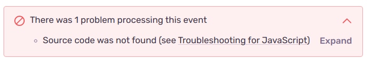

Nowadays every modern web application uses platforms that provide error monitoring in real-time. They have support for different languages and technologies. And that’s great because the quality of development grows every year.

I’m a big fan of tools that help my team instantly react to bugs and crashes and fix them ASAP. It’s necessary when you are building a startup and trying to show your customers the best service. For instance, we used to monitor our frontend errors in `Airbrake` and fixed repeated crashes for the mobile Safari browser. That was a big win because I had started to hate that issue (everyone faced that issue which cost him plenty of hours to find the solution). Recently, my team made the decision to migrate our front-end projects from `Airbrake` to `Sentry`. And like a big part of other developers, I was struggling with uploading source maps there.

I think the following solutions can help those who have `~Next.js@12` and `~@sentry/nextjs@7.3+` versions on their projects.

## Solution 1

If you see a notification similar to that in the picture below on an Issue page inside Sentry don’t fret. `@sentry/nextjs` skipped the uploading of some source maps for Next.js generated files. In my case, those were errors that related to the framework/main files.



A little explanation: When Sentry is reacting to any error or event, it tries to get the source maps from the `release` archive that it has uploaded. According to the GitHub issue conversation, the framework's code does not get uploaded by default anymore and Sentry doesn’t have access to all files for resolving stack trace.

Take a look at this note from Sentry manual setup documentation:

:::important
If you find that there are in-app frames in your client-side stack traces that aren't getting source-mapped even when most others are, it's likely because they are from files in `static/chunks/` rather than `static/chunks/pages/`. By default, such files aren't uploaded because the majority of the files in `static/chunks/` only contain Next.js or third-party code, and are named in such a way that it's hard to distinguish between relevant files (ones containing your code) and irrelevant ones.
:::

To make it upload everything, try to expand your current `next.config.js` with the next properties.

```js title="next.config.js"
module.exports = withSentryConfig(
  {
    ...yourNextConfig,
    sentry: {
      widenClientFileUpload: true,
    },
  },
  {
    ...yourWebpackSentryConfig,
    ignore: [],
  },
  yourSentryConfig,
);
```

It helped me to resolve 2 of the 3 errors that I got. For the majority, it’ll solve 100% of problems with source maps.

## Solution 2

Let’s move on. The last problem was related to a square brackets notation for dynamic route values. If I catch an error on the client side(browser side), the stack trace paths are sent encoded but they’re not decoded when they reach the sentry server. Since the path is encoded and the string `%5Bslug%5D.js` is not equal to `[slug].js`, the source map is not matched/not found/whatever. When Sentry is sending the frames, it includes this encoded URL instead of the decoded URL.

**I’ve found the solution in rewriting StackFrame.**

Just follow the next instructions. Install `@sentry/integrations` package to expand your current client config.

```shell
npm install --save @sentry/integrations
```

```js title="sentry.client.config.js"
import { RewriteFrames } from '@sentry/integrations';

Sentry.init({
  ...yourSentryClientConfig,
  integrations: [
    ...yourSentryClientConfig.integrations,
    new RewriteFrames({
      iteratee: (frame) => {
        frame.filename = frame.filename.replace(distDir, 'app:///_next');
        // here we are decoding our square brackets []
        frame.filename = decodeURI(frame.filename);
        return frame;
      },
    }),
  ],
});
```

Great! I hope this solves at least one person’s problems!

As new technologies constantly evolve, their versions get mismatched and make many developers cry. But god bless a huge programmer community that is glad to share their experience with others.
